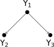

# Understanding Snorkel

## Snorkel under the hood

### Understanding the paper [Training Complex Models[...]](ratner2019training)

Each data point is represented by the tuple $(X, \mathbf{Y})$, with input vector $X\in \mathcal{X}$ and the task label vector $\mathbf{Y}=[Y_1, Y_2, \ldots, Y_t]^T$, corresponding to $t$ tasks. We assume the data points are asampled i.i.d. from distribution $\mathcal{D}$.

The tasks are related by a task graph $G_\mathit{task}$. The feasible sets of label vectors $\mathcal{Y}$, such $\mathbf{Y}\in\mathcal{Y}$. The number of feasible task vectors is defined by $r = |Y|$.

The multi-task weak supervision sources $s_i \in S$ (the label function $\mathit{lf}_i$), represent noisy and potentially incomplete sources of labels (with **unknown accuracies and correlations**). Each source $s_i$ outputs label vectors $\mathbf{\lambda}_i$, which contain non-zero labels for some of the tasks, such that $\mathbf{\lambda}_i$ is in the feasible set $\mathcal{Y}$ but potentially with some elements set to zero, denoting a null vote or abstention for that task. Let $\mathcal{Y_0}$ denote this extended set which includes certain task labels set to zero.

We also assume that each source has a fixed task coverage set $\tau_i$, such that $(\mathbf{\lambda}_i)_s\neq 0$ for $s\in\tau_i$, and $(\mathbf{\lambda}_i)_s=0$ for $s\notin\tau_i$

Let $\mathcal{Y}_{\tau_i}\subseteq\mathcal{Y_0}$  be the range of $\mathbf{\lambda}_i$ given coverage set $\tau_i$. For convenience, we let $\tau_i=\{1,\ldots,t\}$ so that $\mathcal{Y}_{\tau_i}=\mathcal{Y_0}$.

Example:

> Let $Y_1$ classify a data point $X$ as either a *PERSON* ($Y_1 = 1$) or *BUILDING* ($Y_1 = 2$). If $Y_1 = 1$, indicating that $X$ represents a *PERSON*, then $Y_2$ can further label $X$ as a *DOCTOR* or *NON-DOCTOR*. $Y_3$ is used to distinguish between *HOSPITAL* and *NON-HOSPITAL* in the case that $Y_1=2$. The corresponding graph $G_\mathit{task}$ is given by:

> If $Y_1=2$, then task $Y_2$ is not applicable, since $Y_2$ is only suitable for persons; in this case, $Y_2$ takes the value *NA*. In this way the task hierarchy defines a feasible set of task vector values: $Y = [1, 1, \mathit{NA}]^T, [1, 2, \mathit{NA}]^T, [2, \mathit{NA}, 1]^T , [2, N/A, 2]^T$ are valid, while e.g. $Y = [1, 1, 2]^T$ is not.

### Alex Ratner discussion on Github

Snippet of a disussion from GitHub about the Snorkel implementation (**version 0.9**). See [here for the full discussion](https://github.com/snorkel-team/snorkel/issues/1462).

> In this approach, given a set of dependencies between the labeling functions (LFs), we compute the statistics of how different cliques of labeling functions agree and disagree with each other, and then use a matrix completion-style approach to recover the LabelModel parameters from this observed matrix (more precisely: we compute the inverse generalized covariance matrix of the junction tree of the LF dependency graph, and perform a matrix completion-style approach wrt this).

> Regarding the model being learned: currently we learn a model in which we assume the LFs are conditionally independent given the unobserved true label Y, a common assumption in weak supervision / crowd modeling approaches. And, going beyond the data programming paper we published in NeurIPS'16 (referenced above), we actually estimate different LF accuracies for each label class, i.e. we estimate $P(\mathit{lf} | Y)$ for all $\mathit{lf}, Y$. In future releases coming soon, we will also add support for (a) modeling LF dependencies and (b) estimating the LF dependency structure, as we have supported in previous versions of the code and published on (e.g. see our ICML'17 and ICML'19 papers). Hope this helps!

## Learning the dependency of weak labellers

## References

<dt>inproceedings <a name="bach2017learning">(bach2017learning)</a></dt>
<dd>Bach, S. H., He, B., Ratner, A. and R&eacute;, C.</dd>
<dd><i>Learning the structure of generative models without labeled data</i></dd>
<dd>Proceedings of the 34th International Conference on Machine Learning-Volume 70</dd>
<dd><b>2017</b>, pp. 273-282</dd>

<dt>inproceedings <a name="bachman2017learning">(bachman2017learning)</a></dt>
<dd>Bachman, P., Sordoni, A. and Trischler, A.</dd>
<dd><i>Learning algorithms for active learning</i></dd>
<dd>Proceedings of the 34th International Conference on Machine Learning-Volume 70</dd>
<dd><b>2017</b>, pp. 301-310</dd>

<dt>inproceedings <a name="konyushkova2017learning">(konyushkova2017learning)</a></dt>
<dd>Konyushkova, K., Sznitman, R. and Fua, P.</dd>
<dd><i>Learning active learning from data</i></dd>
<dd>Advances in Neural Information Processing Systems</dd>
<dd><b>2017</b>, pp. 4225-4235</dd>

<dt>inproceedings <a name="mahajan2018exploring">(mahajan2018exploring)</a></dt>
<dd>Mahajan, D., Girshick, R., Ramanathan, V., He, K., Paluri, M., Li, Y., Bharambe, A. and van der Maaten, L.</dd>
<dd><i>Exploring the limits of weakly supervised pretraining</i></dd>
<dd>Proceedings of the European Conference on Computer Vision (ECCV)</dd>
<dd><b>2018</b>, pp. 181-196</dd>

<dt>inproceedings <a name="nashaat2018hybridization">(nashaat2018hybridization)</a></dt>
<dd>eNashaat , M., Ghosh, A., Miller, J., Quader, S., Marston, C. and Puget, J.-F.</dd>
<dd><i>Hybridization of Active Learning and Data Programming for Labeling Large Industrial Datasets</i></dd>
<dd>2018 IEEE International Conference on Big Data (Big Data)</dd>
<dd><b>2018</b>, pp. 46-55</dd>

<dt>inproceedings <a name="bach2019snorkel">(bach2019snorkel)</a></dt>
<dd>Bach, S. H., Rodriguez, D., Liu, Y., Luo, C., Shao, H., Xia, C., Sen, S., Ratner, A., Hancock, B., Alborzi, H. and others</dd>
<dd><i>Snorkel drybell: A case study in deploying weak supervision at industrial scale</i></dd>
<dd>Proceedings of the 2019 International Conference on Management of Data</dd>
<dd><b>2019</b>, pp. 362-375</dd>

<dt>article <a name="budd2019survey">(budd2019survey)</a></dt>
<dd>Budd, S., Robinson, E. C. and Kainz, B.</dd>
<dd><i>A Survey on Active Learning and Human-in-the-Loop Deep Learning for Medical Image Analysis</i></dd>
<dd>arXiv preprint arXiv:1910.02923, <b>2019</b></dd>

<dt>inproceedings <a name="cubuk2019autoaugment">(cubuk2019autoaugment)</a></dt>
<dd>Cubuk, E. D., Zoph, B., Mane, D., Vasudevan, V. and Le, Q. V.</dd>
<dd><i>Autoaugment: Learning augmentation strategies from data</i></dd>
<dd>Proceedings of the IEEE conference on computer vision and pattern recognition</dd>
<dd><b>2019</b>, pp. 113-123</dd>

<dt>article <a name="ratner2019snorkel">(ratner2019snorkel)</a></dt>
<dd>Ratner, A., Bach, S. H., Ehrenberg, H., Fries, J., Wu, S. and R&eacute;, C.</dd>
<dd><i>Snorkel: Rapid training data creation with weak supervision</i></dd>
<dd>The VLDB Journal, Springer, <b>2019</b>, pp. 1-22</dd>

<dt>inproceedings <a name="ratner2019training">(ratner2019training)</a></dt>
<dd>Ratner, A., Hancock, B., Dunnmon, J., Sala, F., Pandey, S. and R&eacute;, C.</dd>
<dd><i>Training complex models with multi-task weak supervision</i></dd>
<dd>Proceedings of the AAAI Conference on Artificial Intelligence</dd>
<dd><b>2019</b>, Vol. 33, pp. 4763-4771</dd>

<dt>article <a name="varma2019learning">(varma2019learning)</a></dt>
<dd>Varma, P., Sala, F., He, A., Ratner, A. and R&eacute;, C.</dd>
<dd><i>Learning dependency structures for weak supervision models</i></dd>
<dd>arXiv preprint arXiv:1903.05844, <b>2019</b></dd>